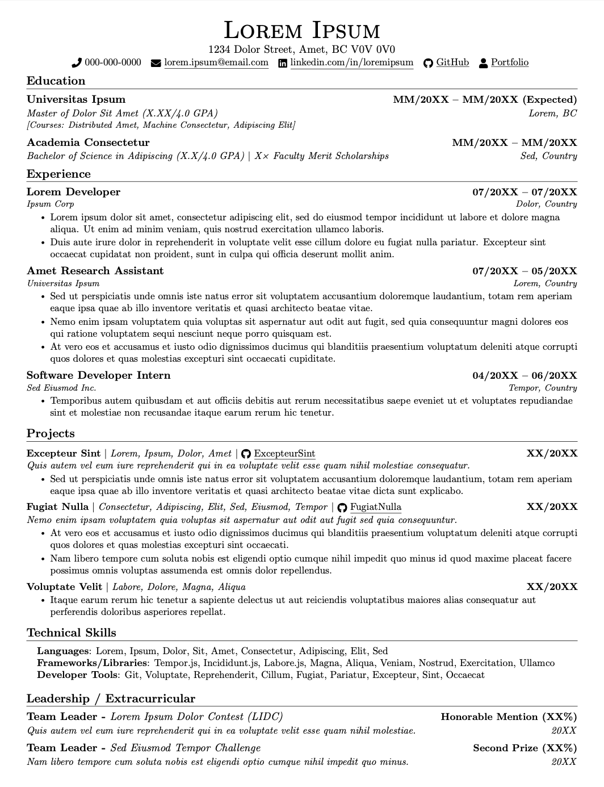
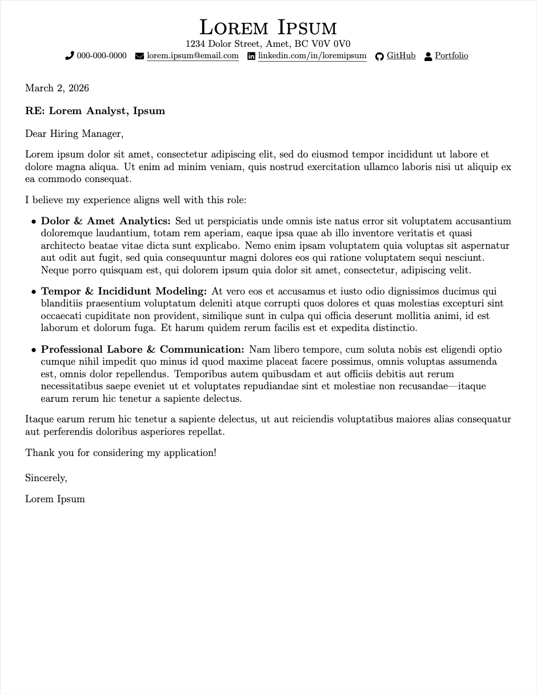

# resume-cl-template


[](preview/resume.pdf)
[](preview/cover-letter.pdf)


A LaTeX template package for job applications — resume and cover letter in one repo, with a shared header to keep your contact info and style consistent across both documents.

## Features

- **One header, two documents** — edit your contact info once in `shared/header.tex`, and both your resume and cover letter stay in sync.
- **ATS-friendly** — machine-readable PDF output with Unicode glyph mapping (`\pdfgentounicode`), clean fonts, and no tables-within-tables tricks that break applicant tracking systems.
- **Modular resume sections** — education, experience, projects, skills, and leadership each live in their own `.tex` file. Reorder, add, or remove sections by editing one line in `main.tex`.
- **Cover letter with conditional fields** — hiring manager name, title, org, and address auto-hide when left blank. Just fill in what you know.
- **Compact one-page layout** — tight margins and spacing tuned for maximum content in a single page.

## Preview

| Resume | Cover Letter |
|:---:|:---:|
|  |  |

## Project Structure

```
├── shared/
│   ├── header.tex          # Contact info (single source of truth)
│   └── packages.tex        # Common LaTeX packages
├── resume/
│   ├── main.tex            # Resume entry point
│   ├── preamble.tex        # Resume-specific commands
│   └── sections/
│       ├── education.tex
│       ├── experience.tex
│       ├── projects.tex
│       ├── skills.tex
│       └── leadership.tex
├── cover-letter/
│   ├── main.tex            # Cover letter entry point
│   ├── recipient.tex       # Hiring manager info
│   └── content.tex         # Letter body
└── .gitignore
```

## Quick Start

1. Clone this repo.
2. Edit `shared/header.tex` with your contact info.
3. Fill in the resume sections under `resume/sections/`.
4. Fill in `cover-letter/content.tex` and optionally `cover-letter/recipient.tex`.
5. Compile and check your PDFs.

## How to Compile

You need a LaTeX distribution installed on your system. Any of these will work:

| Platform | Distribution |
|---|---|
| macOS | [MacTeX](https://www.tug.org/mactex/) |
| Windows | [MiKTeX](https://miktex.org/) |
| Linux | [TeX Live](https://www.tug.org/texlive/) |

Then compile from within each template's folder:

```bash
# Resume
cd resume
pdflatex main.tex

# Cover Letter
cd cover-letter
pdflatex main.tex
```

Or use `latexmk` for automatic rebuilds:

```bash
cd resume && latexmk -pdf main.tex
cd cover-letter && latexmk -pdf main.tex
```

> **Note:** Relative paths (`../shared/`) require compiling from inside the `resume/` or `cover-letter/` directory. Overleaf does not support `\input` across sibling directories — you would need to flatten the shared files into each template folder.

## Acknowledgments

The resume template is modified from [**Jake's Resume**](https://www.overleaf.com/latex/templates/jakes-resume/syzfjbzwjncs) by Jake Gutierrez ([GitHub](https://github.com/jakeryang/resume)), published under the MIT License.

## License

MIT
